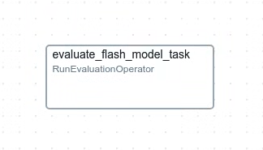

# A Guide to Vertex AI Generative AI Ops on Airflow

This guide moves through the different steps of an GenOps pipeline on Airflow, and provides sample DAGs for entire pipelines and other use-cases.

## Getting Started

What is GenOps?

GenOps, or generative AI operations, refers to the practices and processes involved in managing and operating generative models. Generative Models are artificial intelligence models trained on vast datasets of text and code, enabling them to perform various language-related tasks, such as text generation, translation, and question answering.

GenOps involves a comprehensive set of activities, including:

- Model deployment and maintenance: deploying and managing generative models on cloud platforms or on-premises infrastructure
- Data management: curating and preparing training data, as well as monitoring and maintaining data quality
- Model training and fine-tuning: training and refining generative models to improve their performance on specific tasks
- Monitoring and evaluation: tracking generative model performance, identifying errors, and optimizing models
- Security and compliance: ensuring the security and regulatory compliance of generative model operations

GenOps involves a number of different steps, including:

- Data collection and preparation: generative models require large amounts of data to train. This data must be collected and prepared in a way that is suitable for training the model.
- Model development: generative models are developed using a variety of techniques, including unsupervised learning, supervised learning, and reinforcement learning.
- Model deployment: Once a generative model has been developed, it must be deployed to a production environment. This involves setting up the necessary infrastructure and configuring the model to run on a specific platform.
- Model management: generative models require ongoing management to ensure that they are performing as expected. This includes monitoring the model's performance, retraining the model as needed, and making sure that the model is secure.

Note: the Airflow operators in this guide are brand-new, and are not available in the latest Airflow (2.10.0) release. You will need to clone the [Apache Airflow GitHub repository](https://github.com/apache/airflow/tree/main) to work with them at this point in time. Please stay tuned for future releases to deploy this code in your Airflow environments.

## 1. Generating Content

Customize and deploy Gemini models to production in Vertex AI. Gemini, a multimodal model from Google DeepMind, is capable of understanding virtually any input, combining different types of information, and generating almost any output. Prompt and test Gemini in Vertex AI using text, images, video, or code. With Gemini’s advanced reasoning and generation capabilities, developers can try sample prompts for extracting text from images, converting image text to JSON, and even generate answers about uploaded images.

Airflow provides [GenerativeModelGenerateContentOperator](https://github.com/apache/airflow/blob/d5467d6818ce7f54abd1a7a84c30f321f63405c5/airflow/providers/google/cloud/operators/vertex_ai/generative_model.py#L507) to interact with [Google Generative Models](https://cloud.google.com/vertex-ai/generative-ai/docs/model-reference/inference).


**example:**
```
    pro_model_task = GenerativeModelGenerateContentOperator(
        task_id="pro_model_task",
        project_id=PROJECT_ID,
        location=REGION,
        pretrained_model=PRO_MODEL,
        system_instruction=SYSTEM_INSTRUCTION,
        contents=[SAMPLE_PROMPT],
    )
```
**Sample DAG graph:**


[source code](src/1_generate_content_dag.py)

## 2. Enforcing Budgets

The CountTokens API calculates the number of input tokens before sending a request to the Gemini API. Use the CountTokens API to prevent requests from exceeding the model context window, and estimate potential costs based on billable characters. The CountTokens API can use the same contents parameter as Gemini API inference requests.

Airflow provides [CountTokensOperator](https://github.com/apache/airflow/blob/d5467d6818ce7f54abd1a7a84c30f321f63405c5/airflow/providers/google/cloud/operators/vertex_ai/generative_model.py#L672) to interact with the [Vertex AI Count Tokens API](https://cloud.google.com/vertex-ai/generative-ai/docs/model-reference/count-tokens?hl=en).

**example:**
```
    count_tokens_task = CountTokensOperator(
        task_id="count_tokens_task",
        project_id=PROJECT_ID,
        location=REGION,
        pretrained_model=FLASH_MODEL,
        contents=[SAMPLE_PROMPT],
    )
```
**Sample DAG graph:**


[source code](src/2_count_tokens_dag.py)


## 3. Tuning generative models

Supervised fine-tuning is a good option when you have a well-defined task with available labeled data. It's particularly effective for domain-specific applications where the language or content significantly differs from the data the large model was originally trained on.

Supervised fine-tuning adapts model behavior with a labeled dataset. This process adjusts the model's weights to minimize the difference between its predictions and the actual labels.

Airflow provides [SupervisedFineTuningTrainOperator](https://github.com/apache/airflow/blob/d5467d6818ce7f54abd1a7a84c30f321f63405c5/airflow/providers/google/cloud/operators/vertex_ai/generative_model.py#L582) to interact with the [Vertex AI Tuning API](https://cloud.google.com/vertex-ai/generative-ai/docs/model-reference/tuning).

**example:**
```
    sft_train_base_task = SupervisedFineTuningTrainOperator(
        task_id="sft_train_base_task",
        project_id=PROJECT_ID,
        location=REGION,
        source_model=PRO_MODEL,
        train_dataset=f"gs://{TRAIN_DATA_BUCKET}/{TRAIN_DATA_PATH}",
    )
```

**Sample DAG graph:**


[source code](src/3_supervised_fine_tuning_dag.py)

## 4. Evaluating generative models

The Gen AI Evaluation Service lets you evaluate your generative models, both pointwise and pairwise, across several metrics, with your own criteria. You can provide inference-time inputs, model responses and additional parameters, and the Gen AI Evaluation Service returns metrics specific to the evaluation task.

Metrics include model-based metrics, such as PointwiseMetric and PairwiseMetric, and in-memory computed metrics, such as rouge, bleu, and tool function-call metrics. PointwiseMetric and PairwiseMetric are generic model-based metrics that you can customize with your own criteria. Because the service takes the prediction results directly from models as input, the evaluation service can perform both inference and subsequent evaluation on all models supported by Vertex AI.

Airflow provides [RunEvaluationOperator](https://github.com/apache/airflow/blob/d5467d6818ce7f54abd1a7a84c30f321f63405c5/airflow/providers/google/cloud/operators/vertex_ai/generative_model.py#L741) to interact with the [Vertex AI Rapid Evaluation API](https://cloud.google.com/vertex-ai/generative-ai/docs/model-reference/evaluation).

**example:**
```
    evaluate_flash_model_task = RunEvaluationOperator(
        task_id="evaluate_flash_model_task",
        project_id=PROJECT_ID,
        location=REGION,
        pretrained_model=FLASH_MODEL,
        system_instruction=SYSTEM_INSTRUCTION,
        eval_dataset=EVAL_DATASET,
        metrics=METRICS,
        experiment_name=EXPERIMENT_NAME,
        experiment_run_name=f"{EXPERIMENT_RUN_NAME}-{uuid4()}",
        prompt_template=PROMPT_TEMPLATE,
    )
```

**Sample DAG graph:**



[source code](src/4_run_evaluations_dag.py)

## 5. GenOps Pipelines

Now, we'll put it all together. A sample GenOps pipeline could wait for training data to arrive. Once training data arrives, begin the model tuning process, then evaluate the new model. We could optionally validate the evaluation metrics before moving forward. Or otherwise, ensure our prompt remains within budget and then send requests to our newly trained model.

**Sample DAG graph:**


[source code](src/5_genops_pipeline_dag.py)

## 6. Comparing Models

Going beyond. Use Airflow to compare many models by evaluating them all on the same prompt, uploading evaluation summary metrics to Google Cloud Storage and BigQuery for further analysis.

**Sample DAG graph:**


[source code](src/6_model_comparison_dag.py)

# Next Steps

Stay tuned for additional Vertex AI Operator support in Airflow. There are new model features released every day.

Feel free to check out [samples/](samples/) for inspiration to integrate generative AI into your Airflow DAGs.
